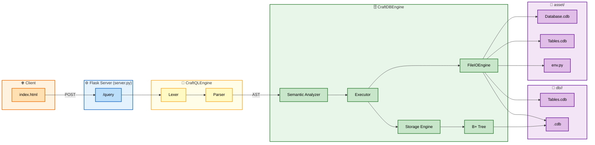

# CraftQL 🛠️

**A relational database engine, query language, and storage system built entirely from scratch in Python.**

CraftQL is a hand-built SQL-like database — custom lexer, parser, semantic analyzer, query executor, and a disk-based B+ tree storage engine, all written without relying on an existing database library. It's designed as a learning-grade and demo-grade DBMS that speaks its own query language: `craft`.

---

## Table of Contents

- [Overview](#overview)
- [Architecture](#architecture)
- [Getting Started](#getting-started)
- [CraftQL Query Language (CQL) Reference](#craftql-query-language-cql-reference)
  - [Database Commands](#database-commands)
  - [Table Commands](#table-commands)
  - [Insert](#insert)
  - [Select (`from`)](#select-from)
  - [Update](#update)
  - [Delete](#delete)
  - [Supported Operators](#supported-operators)
- [Storage Format](#storage-format)
- [Known Limitations / Design Notes](#known-limitations--design-notes)
- [Roadmap](#roadmap)
- [Contributing](#contributing)

---

## Overview

CraftQL is a full-stack, from-scratch implementation of a relational database:

- A custom **query language** (`craft ...`) that mimics familiar SQL patterns (`select`, `insert`, `update`, `delete`, `where`, `order by`, `limit`) under its own syntax.
- **`CraftQLEngine`** — a custom **lexer → parser** pipeline that tokenizes raw query text and builds an Abstract Syntax Tree (AST).
- **`CraftDBEngine`** — the **semantic analyzer → executor → storage engine** that validates, runs, and persists the query. The **Storage Engine** talks only to the **B+ Tree** for row data; a separate **`FileIOEngine`** creates/manages files, folders, and metadata.
- A single on-disk file format, **`.cdb`**, with its own binary row format — no other file types are used.
- A lightweight **Python server** (`server.py`, Flask + flask-cors) that accepts queries from a browser-based UI (`index.html`) and returns results.

It is not built on top of SQLite, Postgres, or any existing DB engine — parsing, storage, and execution are all implemented directly.

## Architecture



**Pipeline, in words:**

1. The browser (**`index.html`**) sends your `craft ...` query to Flask's **`/query`** route (`flask-cors` allows the cross-origin call from the static HTML page).
2. **`CraftQLEngine`** tokenizes and parses it: the **Lexer** breaks the query into tokens, and the **Parser** builds an Abstract Syntax Tree (AST).
3. The AST goes to **`CraftDBEngine`**. The **Semantic Analyzer** validates tables, columns, and types, then passes the validated values to the **Executor**.
4. The **Executor** splits the work two ways:
   - For row-level operations (insert/select/update/delete), it hands off to the **Storage Engine**, which talks only to the **B+ Tree** — the tree structures rows into pages and reads/writes them in a table's `<table>.cdb` file.
   - For database/table-level operations (create, drop, show, describe, rename), it calls the **`FileIOEngine`** directly, which creates/removes the actual files and folders on disk and manages metadata (`Database.cdb`, `Tables.cdb`, `env.py`).
5. Everything lands as **`.cdb`** files. A global **`asset/`** folder holds `Database.cdb` (registry of all databases), `Tables.cdb`, and `env.py` (environment config). Each database then gets its own folder, **`db/<db_name>/`**, containing that database's `Tables.cdb` (its table schemas) and one `<table>.cdb` file per table.
6. Results travel back up through the Executor and Flask, returning as JSON to the browser.

## Getting Started

**Prerequisites:** Python 3.x, along with [Flask](https://flask.palletsprojects.com/) and [flask-cors](https://flask-cors.readthedocs.io/) for the server layer (the query engine and storage layer themselves are pure Python, no dependencies).

1. **Clone the repository**
   ```bash
   git clone https://github.com/sudvig/craftql.git
   cd craftql
   ```

2. **Install dependencies**
   ```bash
   pip install flask flask-cors
   ```

3. **Open the project in VS Code** (or your editor of choice).

4. **Start the server**
   ```bash
   python server.py
   ```
   This starts the CraftQL backend that parses and executes `craft` queries.

5. **Open `index.html`** in your browser (double-click it, or use a Live Server extension).

6. **Type a query** into the console UI and run it — for example:
   ```sql
   craft database use TEMP;
   craft table users(
       id:int,
       name:string,
       age:int,
       primary(id)
   );
   craft insert users (id, name, age) [1, "John", 30];
   craft from users * where age > 18 order by name asc limit 10;
   ```

## CraftQL Query Language (CQL) Reference

All statements start with the `craft` keyword and end with `;`.

### Database Commands

| Command | Status | Description |
|---|---|---|
| `craft database <name>;` | ✅ Supported | Creates a new database |
| `craft database use <name>;` | ✅ Supported | Switches the active database |
| `craft database show;` | ✅ Supported | Lists all databases |
| `craft database drop <name>;` | ✅ Supported | Drops/deletes a database |

**Examples**
```sql
craft database TEMP;
craft database use TEMP;
craft database show;
craft database drop TEMP;
```

### Table Commands

| Command | Status | Description |
|---|---|---|
| `craft table <name>( ... );` | ✅ Supported | Creates a table with typed columns and optional `primary(col)` |
| `craft table drop <name>;` | ✅ Supported | Drops a table |
| `craft table show;` | ✅ Supported | Lists all tables in the active database |
| `craft table describe <name>;` | ✅ Supported | Shows a table's schema |
| `craft table rename <old> to <new>;` | ✅ Supported | Renames a table |

Supported column types: `int`, `string`, `float`.

**Examples**
```sql
-- Table with a primary key
craft table users(
    id:int,
    name:string,
    age:int,
    primary(id)
);

-- Table without a primary key, extra float column
craft table users(
    id:int,
    name:string,
    age:int,
    temp:float
);

craft table drop users;
craft table show;
craft table describe users;
craft table rename users to customers;
```

### Insert

| Form | Status | Description |
|---|---|---|
| `craft insert <table> (cols...) [values];` | ✅ Supported | Insert one row with named columns |
| `craft insert <table> (cols...) [values], [values];` | ✅ Supported | Insert multiple rows with named columns |
| `craft insert <table> [values], [values];` | ✅ Supported | Insert multiple rows positionally (no column names) |

> **Literal formatting:** `string` values are quoted (`"John"`), while `int` and `float` values are written **without quotes** (`1`, `30.5`). Wrapping an `int`/`float` column's value in quotes will insert it as the wrong type.

**Examples**
```sql
-- Single row, named columns
craft insert users (id, name, age) [1, "John", 30];

-- Multiple rows, named columns
craft insert users (id, name, age) [2, "Jane", 25], [3, "Bob", 40];

-- Multiple rows, positional (matches table's declared column order)
craft insert users [2, "Jane", 25], [3, "Bob", 40];
```

### Select (`from`)

```
craft from <table> <columns|*> where <condition> order by <column> <asc|desc> limit <n>;
```

- `<columns|*>` — `*` for all columns, or a comma-separated column list.
- `where` — optional filter condition (see [operators](#supported-operators)).
- `order by` — optional, sorts by a column `asc` or `desc`.
- `limit` — optional, caps the number of returned rows.

**Examples**
```sql
-- All columns, filtered and sorted
craft from users * where age > 30 order by name asc limit 10;

-- Single column
craft from users age where age < 30 order by name desc limit 5;

-- Multiple columns, range condition with AND
craft from users name, age where age >= 18 and age <= 65 order by name asc limit 20;

-- Range condition with OR
craft from users name, age where age >= 18 or age <= 65 order by name desc limit 15;

-- Not-equal condition
craft from users name, age where age != 30 order by name asc limit 10;

-- Equality condition
craft from users name, age where age = 30 order by name desc limit 5;
```

### Update

```
craft update <table> set <col> = <value>, ... where <condition>;
```

- Supports setting one or multiple columns in a single statement.
- `where` supports the same operators and boolean logic (`and` / `or`) as `select`.

**Examples**
```sql
-- Update a single column
craft update users set age = 31 where id = 1;

craft update users set name = "John Doe" where id = 1;

-- Update multiple columns at once
craft update users set age = 32, name = "John Smith" where id = 1;

-- Combined AND condition across two columns
craft update users set qty = 33.12, name = "John Doe" where id = 1 and name = "John Smith";

-- OR condition
craft update users set age = 34 where id = 1 or name = "John Doe";

-- Mixed AND / OR condition
craft update users set age = 35 where id = 1 and name = "John Doe" or age = 30;
```

### Delete

```
craft delete from <table> where <condition>;
```

**Examples**
```sql
craft delete from users where id = 1;
craft delete from users where name = "John Doe";
craft delete from users where age > 30;
craft delete from users where age < 30 and name = "Jane Doe";
craft delete from users where age >= 18 or age <= 65;
```

### Supported Operators

| Operator | Meaning |
|---|---|
| `=` | Equal to |
| `!=` | Not equal to |
| `>` | Greater than |
| `<` | Less than |
| `>=` | Greater than or equal to |
| `<=` | Less than or equal to |
| `and` | Logical AND (combine conditions) |
| `or` | Logical OR (combine conditions) |

## Storage Format

CraftQL persists everything to disk using a single file format: **`.cdb`**, laid out across two folder levels.

**`asset/`** (global, one per install):
- **`Database.cdb`** — registry of all databases
- **`Tables.cdb`** — global table registry
- **`env.py`** — environment configuration

**`db/<db_name>/`** (one folder per database):
- **`Tables.cdb`** — that database's table schemas
- **`<table>.cdb`** — one file per table, holding its row data as B+ tree pages

The **Storage Engine** talks only to the **B+ Tree** — it structures rows into 4096-byte pages with linked leaf nodes (enabling efficient range scans for `order by` / range `where` clauses, plus full deletion via borrow/merge/cascade rebalancing) and reads/writes those pages directly to a table's `<table>.cdb` file. Rows are packed in a fixed binary layout: `int` = 4 bytes, `float` = 8 bytes, `string` = 255 bytes, using bulk struct pack/unpack for performance.

Creating/dropping databases and tables is a separate concern handled by the **`FileIOEngine`**, which creates and removes the actual files and folders on disk and manages the `Database.cdb` / `Tables.cdb` / `env.py` metadata directly — it doesn't go through the B+ Tree.

## Known Limitations / Design Notes

- The current `BTree` class uses **fixed-size pages** rather than a fully dynamic, textbook B+ tree implementation. This was a deliberate simplification to keep the storage layer easier to reason about while the rest of the engine (parser, executor, query language) matured — not a full classic B+ tree yet.
- Only three data types are currently supported: `int`, `float`, `string`.
- The codebase would benefit from a cleanup pass — tightening up the storage layer, reducing duplication in the executor, and moving toward a more textbook-accurate B+ tree. Contributions here are very welcome (see [Contributing](#contributing)).

## Roadmap

- [ ] Natural-language-to-query processing (LLM-powered — type plain English, get a `craft` query)
- [ ] Concurrency control (safe simultaneous reads/writes)
- [ ] ACID-compliant transactions (`begin` / `commit` / `rollback`)
- [ ] Additional data types beyond `int`, `float`, `string` (e.g. `bool`, `date`, `text`)
- [ ] Query optimization & index suggestions
- [ ] Anomaly detection
- [ ] A more textbook-accurate B+ tree (moving off the current fixed-page simplification) + general code cleanup
- [ ] More attractive, polished query console UI
- [ ] storage core for production-grade performance

## Contributing

Issues and pull requests are welcome! A few areas where help would especially move the project forward:

- **New data types** — extending beyond the current `int` / `float` / `string` set (e.g. `bool`, `date`, `text`).
- **UI polish** — the query console (`index.html`) works, but a more attractive, modern UI (better layout, syntax highlighting, result tables, dark mode, etc.) would go a long way.
- **Storage engine cleanup** — evolving the current fixed-page `BTree` implementation toward a more textbook-accurate, dynamically balancing B+ tree, and general code cleanup across the executor/storage layers.
- **Roadmap items above** — transactions, concurrency control, LLM-based natural language queries, and more.

If you're exploring how a database engine works under the hood (lexing, parsing, B+ trees, page-based storage), this project is a good place to dig in and experiment.

---

**Keywords:** database engine from scratch, custom SQL-like query language, Python DBMS, B+ tree implementation, disk-based storage engine, query parser, lexer parser executor, relational database Python, craft query language, CraftQL